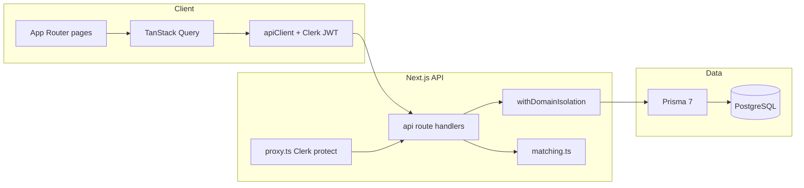
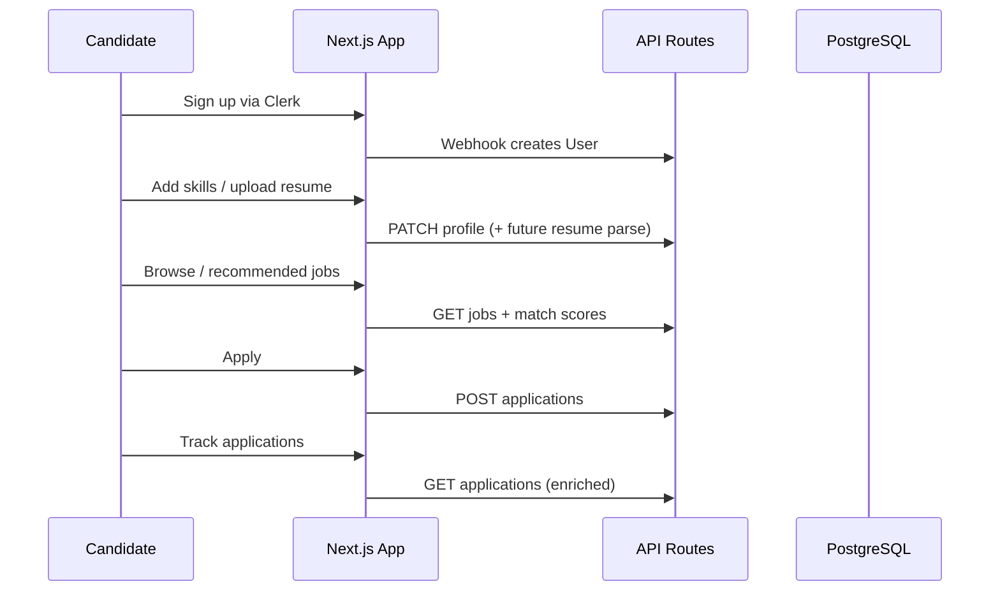
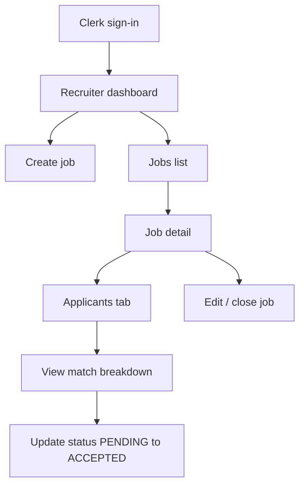
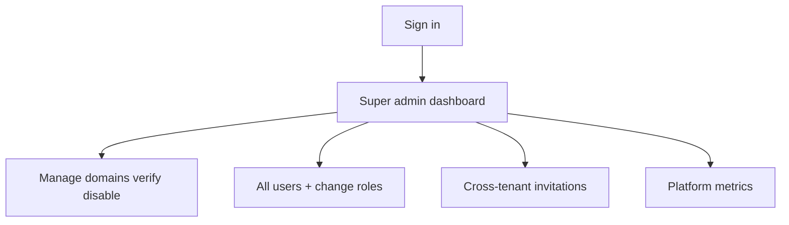

# JobMatcher AI — Improvement Plan

Based on [improvements.md](improvements.md) and a full codebase audit. The project is **not greenfield**: it is a **Next.js 16 monolith** (App Router + API routes), **PostgreSQL/Prisma**, **Clerk** auth, **TanStack Query** on the client, and **deterministic skill-overlap matching** in [src/lib/matching.ts](src/lib/matching.ts)—not LLM-based matching despite the product name.

---

## Current State Summary

### What works today

| Area | Status |
|------|--------|
| Auth & provisioning | Clerk + webhook sync to Prisma ([src/app/api/webhooks/clerk/route.ts](src/app/api/webhooks/clerk/route.ts)) |
| Multi-tenancy | `Domain` model + `withDomainIsolation` on APIs |
| RBAC | Four roles; mostly inline checks per route |
| Candidate path | Skills → browse jobs → match % → apply ([src/app/jobs](src/app/jobs), [src/app/profile](src/app/profile)) |
| Recruiter job posting | `POST /api/jobs`, `/jobs/new` |
| Admin scaffolding | Domains, invitations, read-only users |
| Matching | Server + client: `% of required skills present on User.skills` |

### Architecture (preserve this)

### Critical gaps (audit findings)

**Backend stability / correctness**
- `domain.disabled` is set but **never enforced** on jobs/applications (error code exists in [src/lib/error-messages.ts](src/lib/error-messages.ts) but unused).
- `requirePermission` throws generic `Error` → possible **500 instead of 403** ([src/lib/middleware/rbac.ts](src/lib/middleware/rbac.ts)).
- Super admin with `domainId: null` may be **blocked from creating jobs** ([src/app/api/jobs/route.ts](src/app/api/jobs/route.ts)).
- Duplicate role APIs: `PATCH /users/[id]` vs `PATCH /users/[id]/role`.
- [src/lib/env.ts](src/lib/env.ts) validated but **not bootstrapped** at app start.
- Webhook: no `user.deleted` handling; invitations use `createUser` only (no list/cancel).

**Frontend feature completion**
- Recruiter hiring pipeline **API + hooks exist, UI missing**: job applicants, status updates, edit/delete job.
- Candidate: no withdraw application UI; dashboard shows application IDs not job titles.
- Admin: no role change, domain verify/disable UI despite APIs.
- Navigation: [src/components/site-header.tsx](src/components/site-header.tsx) is role-agnostic; admin pages lack shared layout.

**Product vision gaps (from improvements.md)**
- No resume upload/parsing, saved jobs, notifications, interview scheduling, messaging, analytics APIs, or semantic/AI matching.

---

## Ideal Final Product Vision

A **multi-tenant B2B hiring platform** where:

- **Candidates** onboard with profile + resume-derived skills, get ranked job recommendations, apply once, track status, and receive notifications.
- **Recruiters** post jobs, see AI-ranked applicants per job, move candidates through a pipeline (shortlist → interview → offer), and view lightweight hiring analytics.
- **Company admins** manage team, company profile, and org-wide postings.
- **Super admins** manage tenants (verify/disable domains), moderate jobs, and view platform metrics.

All built on the **existing stack** (Clerk, Prisma schema shape, Next API routes)—extending models only when needed (e.g. `SavedJob`, `Notification`, optional `Resume` metadata).

---

## End-to-End User Flows (target)

### Candidate

### Recruiter

### Super admin

---

## Modular Architecture Recommendations (no rewrite)

Keep monolith; improve boundaries inside it:

| Module | Location | Responsibility |
|--------|----------|----------------|
| **Auth context** | Extend [src/lib/middleware/domainIsolation.ts](src/lib/middleware/domainIsolation.ts) | Load user, enforce `domain.disabled`, attach role |
| **Authorization** | Expand [src/lib/middleware/rbac.ts](src/lib/middleware/rbac.ts) | Replace duplicated inline role checks; map to `AuthorizationError` |
| **Matching** | [src/lib/matching.ts](src/lib/matching.ts) + future `src/lib/matching/semantic.ts` | Keep overlap scorer; add optional embedding layer behind same interface |
| **Services** (new) | `src/server/services/*.ts` | Extract Prisma logic from fat route handlers (jobs, applications, users) |
| **Hooks** | Consolidate duplicate [src/hooks/useJobs.ts](src/hooks/useJobs.ts) / [useJobMutations.ts](src/hooks/useJobMutations.ts) | Single source per resource |
| **UI features** | `src/components/jobs/`, `src/components/applications/` | Applicant table, status badges, pipeline actions |

**Do not** replace Clerk or rebuild auth. **Do not** redesign Prisma models unless a feature requires it.

---

## Phase 0 — Immediate Fixes (stability & honesty)

**Goal:** Runnable, consistent, secure-enough for staging.

1. **Enforce disabled domains** in `withDomainIsolation` (reject non–super-admin when `domain.disabled === true` using existing `DOMAIN_DISABLED` code).
2. **Fix RBAC errors**: `requirePermission` → throw `AuthorizationError` (403), not generic `Error`.
3. **Super admin job creation**: allow `POST /api/jobs` with `domainId` in body when caller is `SUPER_ADMIN` and has no `domainId`.
4. **Unify role updates**: one code path for role/domain changes; deprecate or restrict the duplicate endpoint.
5. **Bootstrap env validation**: import [src/lib/env.ts](src/lib/env.ts) from [src/lib/prisma.ts](src/lib/prisma.ts) or root layout so misconfig fails fast.
6. **Clerk webhook**: handle `user.deleted` (soft-delete or cascade per product decision).
7. **README accuracy**: tone down “Production Ready” / “AI-Powered” until Phase 2+; document actual skill-overlap algorithm.
8. **Frontend quick wins**: role-based nav in [site-header.tsx](src/components/site-header.tsx); wrap `/users`, `/domains`, `/invitations` in a shared admin layout with header; surface React Query `isError` on list pages.

**Files touched:** `domainIsolation.ts`, `rbac.ts`, `jobs/route.ts`, `users/[id]/route.ts`, `webhooks/clerk/route.ts`, `site-header.tsx`, admin page layouts.

---

## Phase 1 — Complete Core Hiring Loop (highest product value)

**Goal:** Recruiters can hire; candidates can manage applications. Uses **existing APIs**.

### Backend (small additions)

- Enrich `GET /api/applications` and dashboard queries with **job title + company/domain name** (Prisma `include`).
- Optional: `GET /api/invitations` for company admins.

### Frontend (primary work)

| Feature | Route / component | APIs / hooks |
|---------|-------------------|--------------|
| Applicants per job | `/jobs/[id]` tab or `/jobs/[id]/applications` | `useJobApplications`, `useUpdateApplicationStatus` |
| Application inbox | `/applications` | `useApplications`, `useApplication` |
| Job edit / delete | `/jobs/[id]/edit` | `useUpdateJob`, `useDeleteJob` |
| Withdraw application | Candidate on job detail or `/applications` | `DELETE /api/applications/[id]` |
| Admin role change | `/users` actions | New `useUpdateUserRole` → `PATCH /users/[id]/role` |
| Domain verify/disable | `/domains` row actions | `useUpdateDomain`, disable route |
| Richer dashboards | Dashboard components | Enriched application + job data |

### Candidate polish

- Application list with job titles, status chips, links to job detail.
- “My applications” as first-class nav item for candidates.

---

## Phase 2 — Matching & Profile Depth (deliver “AI” incrementally)

**Goal:** Better recommendations without throwing away [matching.ts](src/lib/matching.ts).

1. **Skill normalization**: synonym map / canonical tags (e.g. `node` → `nodejs`) in matching layer only.
2. **Weighted scoring**: optional weights per `requiredSkills` entry (schema: `String[]` → JSON skill objects only if needed).
3. **Semantic layer (optional)**: add embedding API (OpenAI/etc.) behind env flag; store embedding on `Job`/`User` only if justified; fallback to overlap scorer when API off.
4. **Resume upload (MVP)**: 
   - Storage: Vercel Blob / S3-compatible.
   - Parse: server route extracts text → heuristic skill list → merge into `User.skills`.
   - No full CV viewer required in v1.
5. **Saved jobs**: Prisma `SavedJob` model + `POST/DELETE/GET` + heart toggle on job cards.

**Schema additions (minimal):** `SavedJob`; optional `resumeUrl`, `resumeParsedAt` on `User`.

---

## Phase 3 — Recruiter & Admin Productivity

| Feature | Approach |
|---------|----------|
| Company profile | Extend `Domain` with logo, description, website (PATCH already partial) |
| Job filters | API query params: skills, status, date; mirror in `/jobs` URL state |
| Shortlisting | Use `ApplicationStatus` + optional `shortlistedAt` field or notes JSON |
| Interview scheduling | `Interview` model + calendar links (MVP: store datetime + notes) |
| Notifications | `Notification` model + in-app bell; email via Clerk or Resend later |
| Platform analytics | `GET /api/analytics/*` aggregations; wire super-admin / company dashboards |
| Rate limiting | Middleware on apply/invite routes (e.g. `@upstash/ratelimit` or simple in-memory for single instance) |

---

## Phase 4 — Production & DevOps

Per improvements.md (no test-suite focus):

- **CI**: GitHub Action — `lint`, `prisma validate`, `next build` on PR.
- **Health**: `GET /api/health` (DB ping).
- **Observability**: Sentry or similar for API errors; structured logs in `handleRouteError`.
- **Deployment**: Document Vercel + Neon/Supabase Postgres + Clerk webhook URLs; optional `Dockerfile` for self-host.
- **Security pass**: validate file MIME/size on upload; sanitize job HTML; audit CORS (same-origin default is fine).
- **Performance**: Prisma `select`/`include` discipline on list endpoints; pagination already exists—ensure all lists use it.

---

## Database Guidance

**Preserve** current models in [prisma/schema.prisma](prisma/schema.prisma). Suggested **additive** migrations only:

| Model / field | When |
|---------------|------|
| `SavedJob` | Phase 2 |
| `User.resumeUrl`, parsed metadata | Phase 2 |
| `Notification` | Phase 3 |
| `Interview` | Phase 3 |
| Skill weights / embeddings | Only if Phase 2 semantic matching is approved |

Avoid renaming `Domain` or changing Clerk-as-`User.id` pattern.

---

## Security (existing auth only)

- Keep Clerk; tighten **authorization** and **tenant isolation** (Phase 0).
- Input validation: Zod schemas shared between API routes (jobs, applications, profile).
- File upload: type whitelist, size cap, virus scan deferred.
- Secrets: never commit `.env`; align `.env.example` with [env.ts](src/lib/env.ts).
- Rate limit: invite and apply endpoints first.

---

## Performance Optimization (as needed)

| Layer | Action |
|-------|--------|
| Frontend | Code-split admin pages; keep React Query `staleTime`; lazy-load heavy tables |
| API | Index already on `domainId`, `jobId`, `userId`—add composite indexes if analytics queries slow |
| Matching | Cache per (userId, jobId) in React Query; server recalc only on profile/job skill change |
| AI | Batch embeddings; async parse resume via background job only if parse time blocks requests |

---

## Prioritized Task List

### High priority (do first)

- Phase 0: disabled domain enforcement, RBAC 403 fix, env bootstrap, super-admin job create
- Phase 1: recruiter applicant UI + application status workflow
- Phase 1: job edit/delete UI
- Phase 1: role-based navigation + admin layout consistency
- Phase 1: enriched application responses (job titles)

### Medium priority

- Phase 1: domain verify/disable + user role UI
- Phase 2: skill normalization + saved jobs
- Phase 2: resume upload MVP
- Phase 3: notifications (in-app)
- Phase 3: company profile fields

### Low priority

- Phase 2: semantic/embedding matching (env-gated)
- Phase 3: interview scheduling, messaging
- Phase 3: hiring analytics depth
- Phase 4: Docker, advanced monitoring
- Subscription/payments (only if product requires)

---

## Smart Improvements (architecture-aligned only)

1. **Single matching interface** — `computeMatch(candidateSkills, job)` used by API and client to avoid drift.
2. **Centralize RBAC** — migrate inline `Role` checks to `requirePermission` gradually.
3. **Feature-based UI** — co-locate applicant table with job detail instead of new framework.
4. **Honest product positioning** — label current matcher “skill overlap”; introduce “AI-enhanced” only when Phase 2 semantic layer ships.
5. **Hook deduplication** — merge duplicate job/application hooks to reduce maintenance.
6. **Do not add** a second auth system, separate Express backend, or GraphQL layer unless scale demands it later.

---

## Success Criteria by Phase

| Phase | Done when |
|-------|-----------|
| 0 | Disabled tenants blocked; 403s correct; env fails fast; README matches reality |
| 1 | Recruiter can review, accept/reject, and edit jobs end-to-end in UI |
| 2 | Resume → skills path works; saved jobs; measurably better match ranking |
| 3 | Notifications + basic analytics + company profile live |
| 4 | CI green on PRs; health check; error tracking in production |

---

## Recommended Implementation Order

1. Phase 0 (1–2 days) — backend invariants + nav/layout fixes  
2. Phase 1 (1–2 weeks) — recruiter pipeline UI + application enrichment  
3. Phase 2 (1–2 weeks) — resume MVP + saved jobs + matching improvements  
4. Phase 3 (ongoing) — notifications, analytics, interviews  
5. Phase 4 (parallel) — CI, health, monitoring as you approach production deploy  

This order maximizes **feature completion and stability** per [improvements.md](improvements.md) without unnecessary rewrites.
